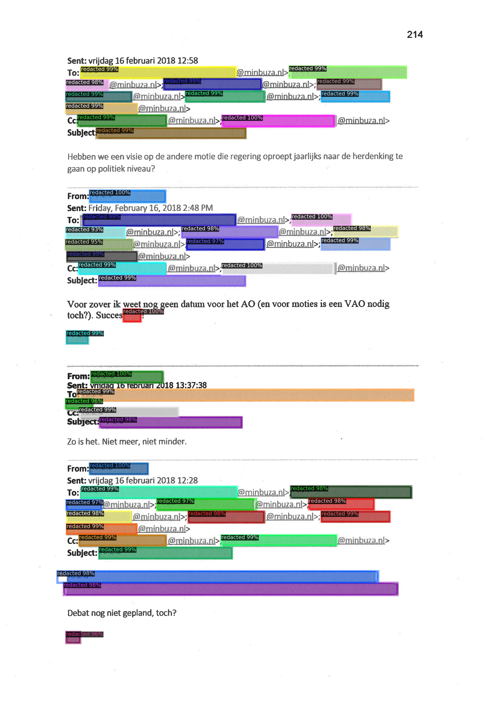

# Redacted Text Detection Using Neural Image Segmentation Methods
This repository contains the data and notebooks for the Master thesis submission 'Redacted Text Detection Using Neural Image Segmentation Methods'.



---

## Project Folder Structure

There are the following folders in the structure:

```buildoutcfg
├── datasets --> a json with the gold standard annotations and the datasets (which only contain images)
│   ├── complete --> all images that also have annotations
│   ├── examples --> example images that are not being used for training or testing
│   │   ├── maskrcnn --> all predictions of the Mask R-CNN model during the result analysis
│   │   └── ocr --> all predictions of the OCR model during the result analysis
│   ├── test --> folder that's reserved for the test set
│   ├── test_extended --> folder that's reserved for the extended test set
│   ├── train --> folder that's reserved for the train set
│   └── train_extended --> folder that's reserved for the extended train set
└── notebooks --> the notebooks containing the experiments and helper notebooks for shared functions
    └── results --> folder that contains the evaluation results of the models (TP, FP, FN, IOU)
```

---

## Installation

To be able to run the notebooks in this repository, follow these steps:

1. Install Tesseract:
    - Visit the [Tesseract website](https://tesseract-ocr.github.io/tessdoc/Installation.html) and follow the installation instructions provided for your specific OS.

2. Install Anaconda: 

   - Visit the [Anaconda website](https://www.anaconda.com/products/individual) and download the installer for your operating system.
   - Follow the installation instructions provided for your specific OS.

3. Clone this repository:
```
git clone https://github.com/Kajzzer/Redacted-Text-Detection
```
4. Navigate to the project directory:
```
cd Redacted-Text-Detection
```
5. Create a new Anaconda environment:

   Open a terminal (or Anaconda Prompt on Windows) and run the following command, which installs the requirements according to the environment file we provide:
   ```
   conda env create -f environment.yml
   ```
   
6. Activate the environment:
  ```
  conda activate redacted-text-detection
  ```

---

<!-- ## Usage

@todo add usage information here

--- -->

<!-- ## How it works

@todo add explanation here

--- -->

## Acknowledgements

I want to thank my supervisor Ruben van Heusden for his help with this project and parts of the code. Additionally I want to thank the Facebook AI Research team for their [Detectron2 library](https://github.com/facebookresearch/detectron2).
